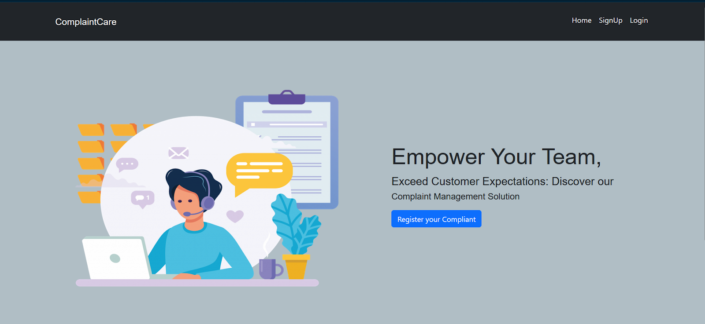
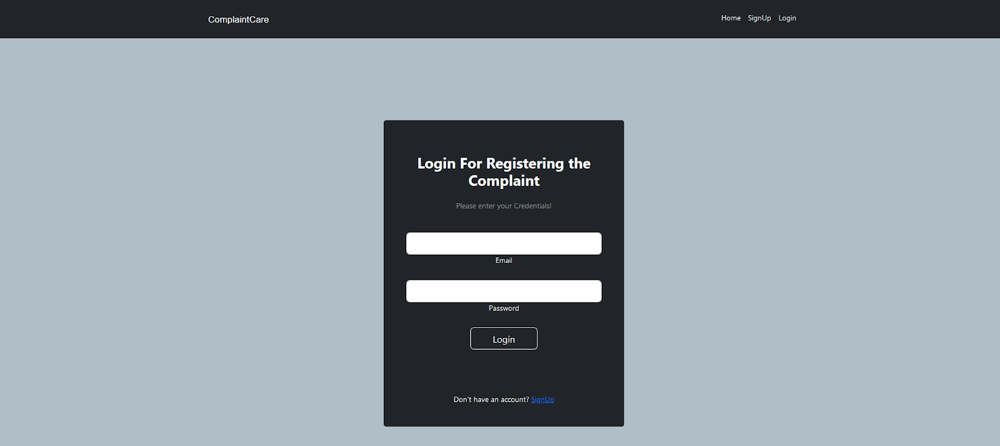
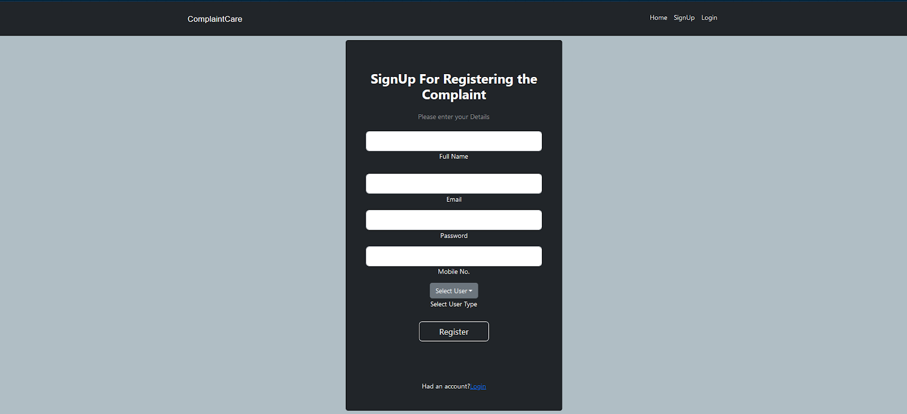
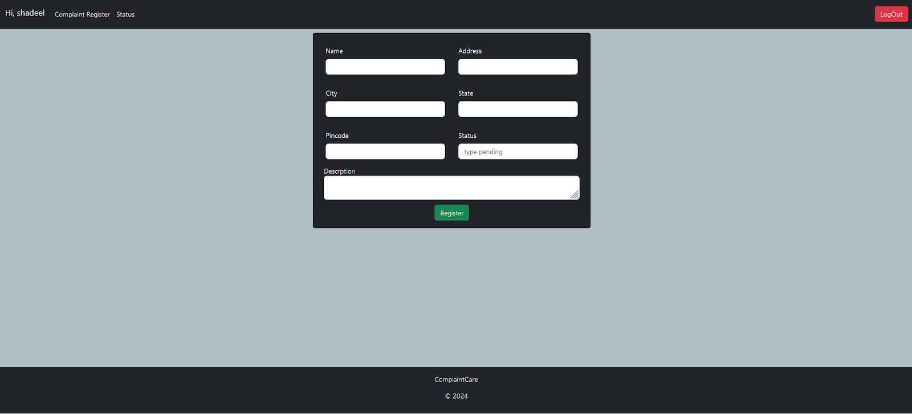
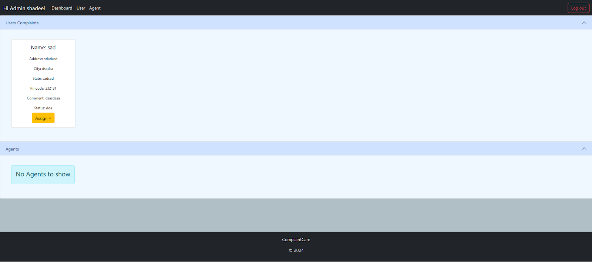
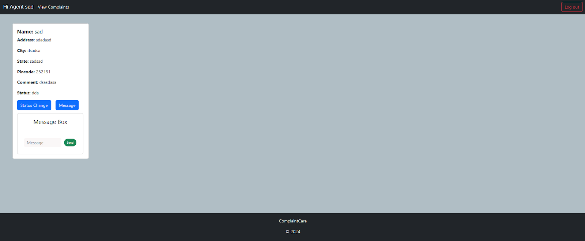
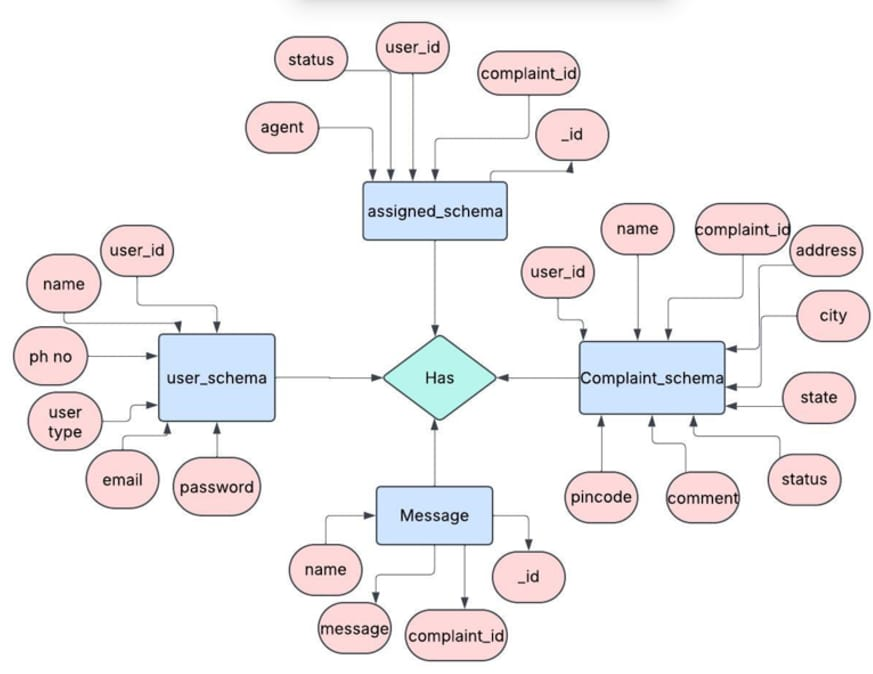

# 🛠️ Online Complaint Registration and Management System

A full-stack web application built using **React.js** (frontend), **Node.js/Express.js** (backend), and **MongoDB** (database) to enable users to register, track, and resolve complaints efficiently.

## 🔍 Project Overview

This system provides a centralized platform for customers, agents, and admins to manage complaints effectively. Key features include:

- 📋 Complaint registration with detailed form input
- 🔄 Real-time complaint tracking with status updates
- 🗣️ Communication between users and assigned agents
- 🛡️ Secure authentication and authorization
- 👩‍💼 Admin dashboard for assigning and managing complaints

---

## 📷 Application Screenshots

### 1. Landing Page  

### 2. Login Page  

### 3. Registration Page  

### 4. User Dashboard  

### 5. Admin Dashboard  

### 6. Agent Dashboard  

> *You can update these image links to your GitHub image URLs after uploading screenshots.*

---

## ⚙️ Tech Stack

| Frontend     | Backend        | Database | Libraries/Tools         |
|--------------|----------------|----------|--------------------------|
| React.js     | Node.js, Express.js | MongoDB  | Axios, Mongoose, Material UI, Bootstrap, JWT, Socket.io |

---

## 🗃️ Project Structure

\`\`\`
complaint-registery/
├── frontend/          # React application
│   ├── public/
│   └── src/
├── backend/           # Node.js + Express app
│   ├── controllers/
│   ├── models/
│   └── routes/
└── README.md
\`\`\`

---

## 🧩 Features by Role

### 👤 Ordinary User:
- Register/Login
- Submit and track complaints
- Chat with assigned agent
- View updates and notifications

### 🧑‍💼 Agent:
- Login and manage assigned complaints
- Interact with users via messaging
- Update complaint statuses

### 👨‍💼 Admin:
- View all complaints
- Assign complaints to agents
- Manage users and agents

---

## 🛠️ Setup Instructions

### Prerequisites

- Node.js & npm  
- MongoDB  
- Git  
- Code Editor (e.g. VSCode)

### Clone Repository

\`\`\`bash
git clone https:https://github.com/Naveen4529/ResolveNow.git
\`\`\`

### Backend Setup

\`\`\`bash
cd backend
npm install
npm start
\`\`\`

### Frontend Setup

\`\`\`bash
cd ../frontend
npm install
npm start
\`\`\`

### Access App

Open your browser and visit:  
\`http://localhost:3000\`

---

## 📊 ER Diagram

---

## 🧪 Project Flow (Customer Journey)

1. **User signs up and logs in**
2. **Submits a complaint**
3. **Receives confirmation and can track status**
4. **Agent gets assigned, communicates via chat**
5. **Admin monitors and assigns complaints**

---

## 🎬 Demo

- 🔗 [**Video Demo**](https://drive.google.com/file/d/1ed8xF31D1ylbbTyxFV4B7bRq30z4nv0y/view?usp=drive_link)
- 🔗 [**Document**](https://docs.google.com/document/d/1HxBGDak-DIkoOWAdjXz0JUD3bNRByumqra1qvAOcCGs/edit?usp=drive_link)
-  🔗[**All media**](https://drive.google.com/drive/folders/10DLOLcn0JYgJdLlW1GIfSoaC1Qfa6KGL?usp=drive_link) 

---

## 📌 Future Improvements

- SMS Notification Integration  
- Advanced analytics for admin  
- Role-based access enhancements  
- Deployment on cloud platforms like Render, Vercel, or Netlify

---

## 🤝 Acknowledgments

This project was developed as a full-stack implementation showcasing complaint handling mechanisms with real-world roles like **Admin**, **Agent**, and **User**.

---

## 📜 License

This project is licensed under the MIT License - see the [LICENSE](LICENSE) file for details.
